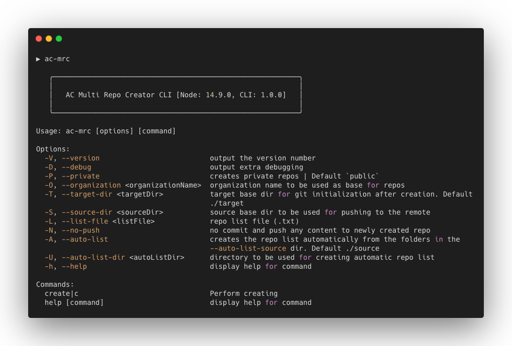

# [WIP] - AC Multi Repo Creator CLI

`ac-multi-repo-creator` is a CLI tool to create multiple GitHub repo at once by using a given list or a source folder to be used for creating a list automatically. 

AC Multi Repo Creator CLI is available for repositories to be hosted on GitHub.com and to install on macOS, Windows, and Linux.

## Documentation

WIP

#